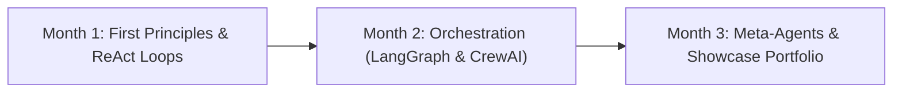

# AI Agents: Zero to Hero Roadmap & Curriculum

A complete, production-grade guide to mastering autonomous AI agents, multi-agent systems, and workflow automation from first principles to building meta-agents (agents that create agents).

---

## 1. The Core Mental Model: What is an AI Agent?

Before writing code or choosing frameworks, understand the agent hierarchy:

```
[Level 0: Prompting] -> [Level 1: Chains/Pipelines] -> [Level 2: Router/Tools] -> [Level 3: Autonomous ReAct Agent] -> [Level 4: Multi-Agent Swarm] -> [Level 5: Meta-Agent (Self-Generating)]
```

### The 4 Pillars of Every Agent
1. **Brain (LLM)**: Handles reasoning, intent parsing, planning, and synthesis.
2. **Tools (Actuators)**: Functions the LLM can decide to run (web search, file read/write, API calls, shell execution).
3. **Memory**:
   - *Short-Term*: In-context conversation history and scratchpad thoughts.
   - *Long-Term*: Vector databases (Chroma, LanceDB) or key-value stores for past executions and user preferences.
4. **Control Loop (Planning & Reflection)**:
   - **ReAct Loop** (*Reasoning + Acting*):
     $$\text{Observation} \rightarrow \text{Thought (Reasoning)} \rightarrow \text{Action (Tool Call)} \rightarrow \text{Observation} \rightarrow \dots \rightarrow \text{Final Answer}$$
   - **Reflection & Self-Correction**: Checking tool output, detecting failures, and re-attempting alternative paths.

---

## 2. JavaScript to Python Fast-Track (3-Day Transition)

Because you already know JavaScript and Node.js, learning Python for agents takes **2 to 3 days**. You already know variables, control flow, async programming, and APIs.

### Quick Concept Mapping

| Concept | JavaScript / Node.js | Python 3.11+ |
| :--- | :--- | :--- |
| **Package Manager** | `npm` / `pnpm` | `uv` (modern, ultra-fast) or `poetry` / `pip` |
| **Virtual Environment**| `node_modules` | `uv venv` / `python -m venv .venv` |
| **Async / Await** | `async function() { await ... }` | `async def run(): await ...` (using `asyncio`) |
| **Objects / Dictionaries** | `const user = { name: "Alex" }` | `user = {"name": "Alex"}` |
| **Schema Validation** | `zod` (`z.object({...})`) | `pydantic` (`class User(BaseModel): ...`) |
| **Decorators** | Experimental / TS Decorators | Native: `@tool`, `@app.get()`, `@property` |
| **String Formatting** | Template literals `` `Hello ${name}` `` | f-strings `f"Hello {name}"` |
| **File I/O** | `fs.promises.readFile(...)` | `with open("file.txt", "r") as f: ...` |

> [!TIP]
> **Why Python for Agents?**
> The entire ecosystem (LangGraph, CrewAI, AutoGen, LlamaIndex, LiteLLM, PyTorch, HuggingFace) releases first in Python. Pydantic is natively supported by LLM function-calling protocols for guaranteed JSON schemas.

---

## 3. The 100% Open-Source & Hybrid Tech Stack

| Component | Recommended Tool | Why It Fits You |
| :--- | :--- | :--- |
| **Local Model Runner** | **Ollama** | Runs Llama 3.2 (3B/8B), Qwen 2.5 Coder, Mistral locally on Mac with one command (`ollama run llama3.2`). |
| **Cloud Model (Heavy)** | **Gemini 2.0 / 1.5 Pro** & **Groq** | Free/inexpensive tier, 1M+ token context window, extremely fast tool calling. |
| **Universal LLM Bridge** | **LiteLLM** | One unified API syntax for 100+ models. Switch between Ollama and Gemini with 1 config line. |
| **Core Agent Framework** | **LangGraph** | Industry standard for stateful, cyclic graphs (loops, human-in-the-loop, deterministic agent routing). |
| **Multi-Agent Framework** | **CrewAI** | Role-based collaboration (Researcher, Writer, QA Critic). Intuitive and highly productive. |
| **Vector DB / Memory** | **ChromaDB** or **LanceDB** | Embedded, serverless, zero Docker needed to start. Runs directly in Python. |
| **Tool Protocol** | **Model Context Protocol (MCP)** | Open standard from Anthropic to plug databases, GitHub, filesystem, and web tools into any agent. |

---

## 4. Curated Video Resources & High-Yield Learning Materials

### Free Video Courses (Directly on DeepLearning.AI by Andrew Ng)
1. **[Functions, Tools and Agents with LangChain](https://www.deeplearning.ai/short-courses/functions-tools-agents-langchain/)** (1 hr)  
   *Must watch first.* Explains function calling, JSON schema generation, and ReAct loops.
2. **[AI Agents in LangGraph](https://www.deeplearning.ai/short-courses/ai-agents-in-langgraph/)** (1 hr)  
   Taught by Harrison Chase (Founder of LangChain). Teaches state graphs, human-in-the-loop, and persistence.
3. **[Multi AI Agent Systems with crewAI](https://www.deeplearning.ai/short-courses/multi-ai-agent-systems-with-crewai/)** (1 hr)  
   Taught by João Moura (Founder of CrewAI). Covers multi-agent role-playing, delegation, and inter-agent communication.
4. **[Building Agentic RAG with LlamaIndex](https://www.deeplearning.ai/short-courses/building-agentic-rag-with-llamaindex/)** (1 hr)  
   Teaches agents that don't just search vectors, but query, route, and synthesize documents adaptively.

### Top YouTube Channels for Hands-on Coding
- **[Dave Ebbelaar](https://www.youtube.com/@daveebbelaar)**: Practical architecture tutorials on LangGraph, AutoGen, and production agent design patterns.
- **[LangChain YouTube](https://www.youtube.com/@LangChain)**: Official weekly deep dives on LangGraph, multi-agent workflows, and tool calling.
- **[IndyDevDan](https://www.youtube.com/@indydevdan)**: First-principles builder. Excellent videos on raw ReAct loops, prompt engineering, and Model Context Protocol (MCP).
- **[Cole Medin](https://www.youtube.com/@ColeMedin)**: Covers CrewAI, AutoGen, and building autonomous systems step-by-step.

---

## 5. The 12-Week Zero-to-Hero Roadmap (10-20 hrs/week)



### Month 1: First Principles & Raw Tool Calling (No Frameworks First!)

> **Goal**: Understand *how* agents work under the hood without relying on black-box libraries.

#### Week 1: Python Bridge & Direct Model Tool Calling
- **Tasks**:
  - Install Python 3.11+ and `uv` package manager (`curl -LsSf https://astral.sh/uv/install.sh | sh`).
  - Install Ollama (`brew install ollama`) and pull `llama3.2` and `qwen2.5-coder:7b`.
  - Connect to Gemini API using Python's official SDK or `litellm`.
  - Learn Pydantic: Define structured schemas and tool parameter signatures.
- **Hands-on Exercise**: Write a script where Gemini calls a local Python function (e.g., `calculate_math(expression)` or `get_current_weather(city)`).

#### Week 2: Building the ReAct Loop from Scratch
- **Tasks**:
  - Write an autonomous while loop without LangChain:
    1. Send user prompt + tool descriptions to model.
    2. Model returns tool call instruction (`{"tool": "read_file", "args": {"path": "notes.txt"}}`).
    3. Python executes the function locally.
    4. Send tool result back to the model as an observation.
    5. Loop until model decides it has the final answer.
- **Hands-on Exercise**: Add error handling: what happens if the tool throws an exception? Feed the error back to the LLM so it retries!

#### Week 3: Memory & State Persistence
- **Tasks**:
  - Implement conversation sliding-window memory (summarizing past context when token limits approach).
  - Setup **ChromaDB**: Store text embeddings locally.
  - Implement Semantic Memory: Agent queries its vector database for past user preferences before responding.
- **Hands-on Exercise**: Build an agent that remembers facts about you across different terminal sessions.

#### Week 4: Capstone 1 — **Autonomous Daily Research & Digest Agent**
- **What it does**: Takes a research topic (e.g., "AI agent open-source developments this week"), browses 3-5 sites using DuckDuckGo search + web scraping, extracts key takeaways, writes a markdown report, and saves it to disk.
- **Deliverables**: Working CLI tool, clean README, 2-minute demo video.

---

### Month 2: Orchestration Frameworks & Production Patterns

> **Goal**: Master production tools to build complex, reliable, stateful workflows.

#### Week 5: Stateful Graphs with LangGraph
- **Tasks**:
  - Watch DeepLearning.AI *AI Agents in LangGraph*.
  - Understand Core Concepts: `State`, `Nodes`, `Edges`, and `Conditional Edges`.
  - Implement cycles: Loop until a validation check passes.
  - Implement **Human-in-the-loop**: Pause execution, ask user approval in CLI/web UI before running destructive commands.
- **Hands-on Exercise**: Build a customer support triage workflow that routes between FAQ, billing, and human escalation.

#### Week 6: Structured Output, Guardrails & Evaluation
- **Tasks**:
  - Enforce strictly typed outputs with Pydantic and JSON mode.
  - Implement self-reflection: Agent A generates output; Agent B (Critic) audits it against criteria; if failed, loops back to Agent A.
  - Add timeout and token budgeting guardrails so agents never run into infinite loops.
- **Hands-on Exercise**: Build a data extraction agent that extracts invoice details from raw text and validates line items mathematically.

#### Week 7: Multi-Agent Collaboration with CrewAI
- **Tasks**:
  - Watch DeepLearning.AI *Multi AI Agent Systems with crewAI*.
  - Assign distinct roles: Researcher Agent, Analyst Agent, and Executive Writer Agent.
  - Test sequential vs hierarchical execution (Manager Agent delegating tasks to sub-agents).
- **Hands-on Exercise**: Multi-agent product comparison crew (Agent 1 scrapes specs, Agent 2 writes pros/cons, Agent 3 formats final recommendation).

#### Week 8: Capstone 2 — **Autonomous GitHub/Code Assistant**
- **What it does**: Given a repository or local project, reads issues or TODO comments, creates a reproducible unit test, generates the fix, runs tests in a sandbox, and submits a clean git commit or pull request.
- **Deliverables**: GitHub repo, walkthrough video, automated test suite.

---

### Month 3: Meta-Agents, Model Context Protocol (MCP) & Showcase

> **Goal**: Build self-generating agents, standard tool protocols, and full-stack portfolio showcases.

#### Week 9: Model Context Protocol (MCP) Integration
- **Tasks**:
  - Learn Anthropic's open-source Model Context Protocol (`mcp`).
  - Connect open-source MCP servers (filesystem, Postgres/SQLite, GitHub, Brave Search).
  - Convert any existing custom Python function into an MCP-compliant server.
- **Hands-on Exercise**: An agent capable of querying any SQLite database dynamically using the official SQLite MCP server.

#### Week 10 & 11: Capstone 3 (The Dream Project) — **The Meta-Agent (Agent Generator)**
- **Architecture of the Self-Generating Agent**:
  ```mermaid
  flowchart TD
      User["User Goal: 'I want an agent to monitor my AWS spend'"] --> Architect["Architect Agent (Deconstructs Requirements)"]
      Architect --> ToolGen["Tool Synthesizer (Generates Python Tool Code)"]
      ToolGen --> Tester["Sandbox Tester (Validates Tool Execution)"]
      Tester -- "If tool fails" --> ToolGen
      Tester -- "Passes" --> Assembler["Agent Assembler (Generates LangGraph / CrewAI Spec)"]
      Assembler --> Spawn["Spawns Executable Sub-Agent"]
      Spawn --> Done["Delivers Ready-to-Run Agent to User"]
  ```
- **Key Modules**:
  1. *Prompt-to-Tool Generator*: Writes Python functions dynamically based on API docs.
  2. *Safety Sandbox*: Runs generated tool code safely using restricted subprocesses or Docker.
  3. *Agent Config Compiler*: Writes a ready-to-run `agent.py` script customized for that task.

#### Week 12: Packaging, UI & Portfolio Launch
- **Tasks**:
  - Wrap your agents with a lightweight UI: **Streamlit** (Python pure frontend) or **Next.js + FastAPI**.
  - Write detailed engineering write-ups on LinkedIn / GitHub / Dev.to.
  - Record 3-minute loom walkthroughs demonstrating real execution.
  - Add automated CI/CD and unit tests to each repo.

---

## 6. Daily / Weekly Study Routine (10-20 Hours/Week)

### Weekly Schedule Breakdown

| Day | Focus | Activity (1.5 - 2.5 hrs/day) |
| :--- | :--- | :--- |
| **Monday** | **Theory & Video** | Watch 1 module/short course (DeepLearning.AI or LangGraph docs). |
| **Tuesday** | **Code Recreation** | Code the lesson from scratch in your own editor (no copy-pasting). |
| **Wednesday** | **Break & Fix** | Intentionally give faulty inputs, break tool calls, and write recovery logic. |
| **Thursday** | **Automation Integration**| Wire the day's concept into one of your real personal daily tasks. |
| **Friday** | **Open-Source Experiment**| Swap model to local Ollama (Llama 3.2 / Qwen), benchmark latency and accuracy. |
| **Saturday** | **Project Build (3-4 hrs)**| Build the week's capstone project module. |
| **Sunday** | **Review & Document** | Commit to GitHub, write a brief summary of what you learned. |

---

## 7. Immediate Next Step: Day 1 Setup

To get your hands dirty right now:
1. Open your terminal.
2. Install `uv` (modern Python package manager):
   ```bash
   curl -LsSf https://astral.sh/uv/install.sh | sh
   ```
3. Create your first agent workspace:
   ```bash
   uv init agent-lab && cd agent-lab
   uv add litellm pydantic rich
   ```
4. Install and start Ollama in another terminal window:
   ```bash
   brew install ollama
   ollama serve
   ollama pull llama3.2:3b
   ```
